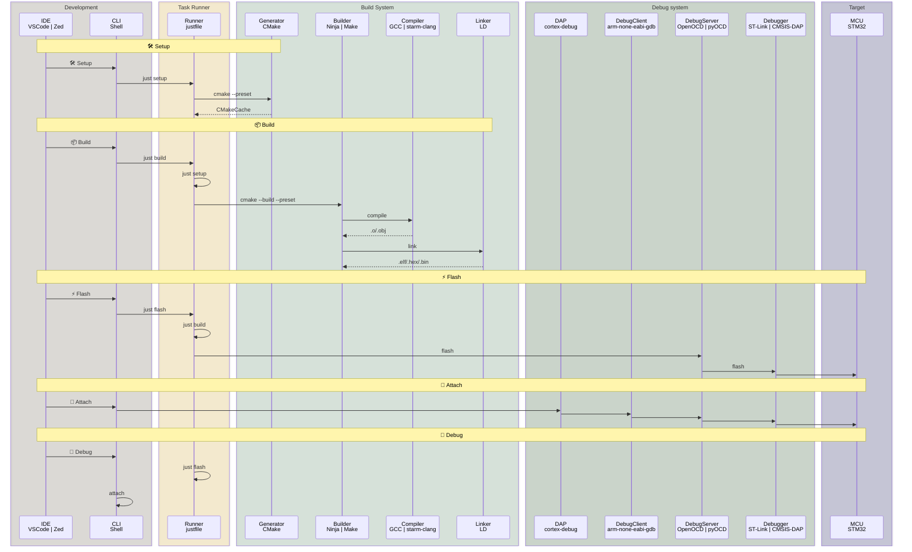

# stm32_prj_tmpl

> 一个为 STM32CubeMX 生成的项目提供的开发模版

## 特点

- 支持全平台：Windows、Linux、macOS
- 支持多种开发环境：Visual Studio Code、Zed

## 开始使用

1. 安装依赖

```sh
# Windows
winget install Casey.Just Kitware.CMake Ninja-build.Ninja Arm.GnuArmEmbeddedToolchain Microsoft.VisualStudioCode Git.Git
# macOS
brew install just cmake ninja gcc-arm-embedded open-ocd visual-studio-code git
# Linux
apt install just cmake ninja-build gcc-arm-none-eabi openocd git
```

```sh
pipx install pyocd
pyocd pack install stm32f407
```

2. 使用`STM32CubeMX`配置工程为 CMake 模式后生成目标项目
3. 将本项目中的所有文件拷贝到目标项目文件夹中
4. 使用`Visual Studio Code`或`Zed`打开项目文件夹
5. 通过 GUI 或者 CLI 进行开发、调试

## 任务

| 任务     | 入口              | 功能                                                          | 输出/操作                                                       |
| -------- | ----------------- | ------------------------------------------------------------- | --------------------------------------------------------------- |
| 🛠️ 配置  | just setup/s      | 解析 CMakeLists.txt，检测系统环境，生成构建系统描述文件       | CMakeCache.txt,CMakeFiles/,构建系统描述文件（如 Makefile 模板)  |
| 📦 构建  | just build/b      | 调用底层构建工具（如 Make/Ninja/MSBuild）​ 编译源代码并链接 ​ | .o/.obj（对象文件）.a/.lib（静态库）.elf/.hex（目标可执行文件） |
| 🧹 清理  | just clean/c      | 删除构建产物 ​（对象文件、可执行文件等）                      | 清理 build/目录下所有产物                                       |
| ⚡️ 烧录 | just flash/f      | 将可执行文件烧录到目标设备                                    | 通过 openocd/pyocd 将.elf/.hex/.bin 烧录到目标设备              |
| 🔗 链接  | just attach/a GUI | 连接到调试会话 ​（需配合 IDE 和调试器）                       | 无需下载                                                        |
| 🐞 调试  | just debug/d GUI  | 启动调试会话 ​（需配合 IDE 和调试器）                         | 烧录后启动调试会话                                              |

| IDE    | 任务快捷键                  | GUI                 |
| ------ | --------------------------- | ------------------- |
| vscode | Command + Shift + B (Build) | actboy168.tasks     |
| zed    | Command + Shift + R (Run)   | native(coming soon) |

## 开发环境

| 功能       | 工具                 | 功能                                                                   |
| ---------- | -------------------- | ---------------------------------------------------------------------- |
| 任务运行器 | Just                 | 跨平台提供统一任务入口                                                 |
| 构建生成器 | CMake                | 根据 CMakeLists.txt 对项目的构建方法进行编排                           |
| 构建执行器 | Ninja                | 根据构建生成器生成的构建系统描述文件，执行构建任务                     |
| 编译器     | GCC                  | 接收执行器的调配，将源文件编译为目标文件，并将目标文件链接成可执行文件 |
| 调试服务器 | pyocd/openocd        | 连接终端或 DAP 与 Debugger 的桥梁                                      |
| DAP        | cortex-debug(vscode) | 连接 GUI 与调试服务器的桥梁                                            |

## 文件列表

```
├── .gitattributes # git文件属性控制
├── .gitignore # git系统忽略的文件
├── .justfile # 任务入口（配置、构建、清理、烧录）
├── .vscode # vscode配置
│   ├── c_cpp_properties.json # LSP配置(读取compile_commands.json)
│   ├── extensions.json # 扩展插件
│   ├── launch.json # 调试会话配置
│   ├── settings.json # 项目配置
│   └── tasks.json # vscode任务（调用justfile）
├── .zed # zed 配置
│   ├── debug.json # 调试会话配置
│   ├── settings.json # LSP配置（clangd,读取compile_commands.json）
│   └── tasks.json # zed任务（调用justfile）
├── openocd.cfg # openocd配置文件（for vscode extension `cortex-debug` to call openocd）
└── README.md
```

## 工作流



## 备注

1. 如需添加源码到编译系统，请参考`cmake/user/CMakeLists.txt`文件
2. 如需生成`HEX`和`BIN`文件，请将下列内容放到工程根目录下`CMakeLists.txt`的末尾：

```cmake
################ HEX Generation ################
add_custom_command(TARGET ${CMAKE_PROJECT_NAME} POST_BUILD
    COMMAND ${CMAKE_OBJCOPY} -O ihex $<TARGET_FILE:${CMAKE_PROJECT_NAME}> ${CMAKE_PROJECT_NAME}.hex
    COMMENT "HEX generated: ${CMAKE_PROJECT_NAME}.hex"
    VERBATIM
)

################ BIN Generation ################
add_custom_command(TARGET ${CMAKE_PROJECT_NAME} POST_BUILD
    COMMAND ${CMAKE_OBJCOPY} -O binary $<TARGET_FILE:${CMAKE_PROJECT_NAME}> ${CMAKE_PROJECT_NAME}.bin
    COMMENT "BIN generated: ${CMAKE_PROJECT_NAME}.bin"
    VERBATIM
)
```
